Lab 8: Used-Available RSF Models - glmmTMB notes
================
Eric Palm and Mark Hebblewhite
February 08, 2023

I use the development version of `glmmTMB` and `broom.mixed` just
because Ben Bolker is always updating stuff.

The `bbmle` package is great for the `AICtab` and `BICtab` functions to
compare model parsimony. `sjPlot` is great for quick plots of
coefficients.

``` r
ipak <- function(pkg){
  new.pkg <- pkg[!(pkg %in% installed.packages()[, "Package"])]
  if (length(new.pkg)) 
    install.packages(new.pkg, dependencies = TRUE)
  sapply(pkg, require, character.only = TRUE)
}

#load or install these packages:
packages <- c("glmmTMB", "tidyverse", "broom.mixed", "bbmle", "sjPlot", "GGally", "lme4")
#run function to install packages
ipak(packages)
```

    ## Warning in checkMatrixPackageVersion(): Package version inconsistency detected.
    ## TMB was built with Matrix version 1.5.3
    ## Current Matrix version is 1.5.1
    ## Please re-install 'TMB' from source using install.packages('TMB', type = 'source') or ask CRAN for a binary version of 'TMB' matching CRAN's 'Matrix' package

    ##     glmmTMB   tidyverse broom.mixed       bbmle      sjPlot      GGally 
    ##        TRUE        TRUE        TRUE        TRUE        TRUE        TRUE 
    ##        lme4 
    ##        TRUE

First I just need to load and prepare the`elk2` data frame that we used
in LAb 7 to fit the models below.

``` r
elk <- read.table("Data/lab7_elk_migrant.csv", header=TRUE, sep=",", na.strings="NA", dec=".", strip.white=TRUE)
elk$elkuidF <- as.factor(elk$elkuid)
elk2 <- elk[complete.cases(elk[30:31]), ]
elk2$ctotrisk[elk2$ctotrisk>1]=1
elk2$totalherb_sc <- as.numeric(scale(elk2$totalherb))
elk2$ctotrisk_sc <- as.numeric(scale(elk2$ctotrisk))
elk2$ctotrisk2_sc <- as.numeric(scale(elk2$ctotrisk2))
elk2$riskforage_sc <- as.numeric(scale(elk2$riskforage))
elk2$for2_sc <- as.numeric(scale(elk2$for2))
elk2$risk2_sc <- as.numeric(scale(elk2$risk2))
```

# Reviewing Fixed- and Random-effects models from Lab 7

## Top fixed-effects model with scaled covariates

Now we will refit the same model wtih scaled coefficients, that makes
comparing the coefficients easier, though we note that the Z-values and
P-values remain nearly identical.

``` r
forrisk_sc = glm(used~totalherb_sc+ctotrisk_sc+ctotrisk_sc*totalherb_sc, data=elk2,family=binomial(link="logit"))
summary(forrisk_sc)
```

    ## 
    ## Call:
    ## glm(formula = used ~ totalherb_sc + ctotrisk_sc + ctotrisk_sc * 
    ##     totalherb_sc, family = binomial(link = "logit"), data = elk2)
    ## 
    ## Deviance Residuals: 
    ##     Min       1Q   Median       3Q      Max  
    ## -4.0397  -0.9646  -0.8637   1.0778   1.5279  
    ## 
    ## Coefficients:
    ##                          Estimate Std. Error z value Pr(>|z|)    
    ## (Intercept)               0.12031    0.01269   9.483  < 2e-16 ***
    ## totalherb_sc              1.10718    0.01828  60.565  < 2e-16 ***
    ## ctotrisk_sc              -0.08504    0.01321  -6.439  1.2e-10 ***
    ## totalherb_sc:ctotrisk_sc -0.17336    0.01103 -15.724  < 2e-16 ***
    ## ---
    ## Signif. codes:  0 '***' 0.001 '**' 0.01 '*' 0.05 '.' 0.1 ' ' 1
    ## 
    ## (Dispersion parameter for binomial family taken to be 1)
    ## 
    ##     Null deviance: 47672  on 34389  degrees of freedom
    ## Residual deviance: 42208  on 34386  degrees of freedom
    ## AIC: 42216
    ## 
    ## Number of Fisher Scoring iterations: 4

``` r
ggcoef(forrisk_sc, exclude_intercept = TRUE)
```

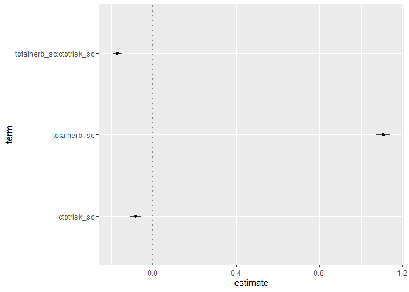<!-- -->

``` r
elk2$naive.pred <-predict(forrisk_sc, type = "response")
```

## Random Coefficients - Mixed-Effects Model with Random Coefficient

Based on our Lab 7 two-step models, we saw that there was a lot more
variation in the response of elk to total predation risk. So, here we
will fit random coefficients to wolf predation risk.

``` r
fr.rc = glmer(used~totalherb_sc+ctotrisk_sc+totalherb_sc*ctotrisk_sc+(ctotrisk_sc|elkuid), data=elk2,family=binomial(link="logit"), verbose=FALSE)
summary(fr.rc)
```

    ## Generalized linear mixed model fit by maximum likelihood (Laplace
    ##   Approximation) [glmerMod]
    ##  Family: binomial  ( logit )
    ## Formula: used ~ totalherb_sc + ctotrisk_sc + totalherb_sc * ctotrisk_sc +  
    ##     (ctotrisk_sc | elkuid)
    ##    Data: elk2
    ## 
    ##      AIC      BIC   logLik deviance df.resid 
    ##  38338.0  38397.1 -19162.0  38324.0    34383 
    ## 
    ## Scaled residuals: 
    ##    Min     1Q Median     3Q    Max 
    ##    -44     -1      0      1  64054 
    ## 
    ## Random effects:
    ##  Groups Name        Variance Std.Dev. Corr
    ##  elkuid (Intercept)  8.53    2.921        
    ##         ctotrisk_sc 72.82    8.533    0.97
    ## Number of obs: 34390, groups:  elkuid, 17
    ## 
    ## Fixed effects:
    ##                          Estimate Std. Error z value Pr(>|z|)    
    ## (Intercept)              -1.34763    0.65136  -2.069   0.0386 *  
    ## totalherb_sc              0.99773    0.01972  50.598   <2e-16 ***
    ## ctotrisk_sc              -4.07979    1.86042  -2.193   0.0283 *  
    ## totalherb_sc:ctotrisk_sc -0.13395    0.01414  -9.474   <2e-16 ***
    ## ---
    ## Signif. codes:  0 '***' 0.001 '**' 0.01 '*' 0.05 '.' 0.1 ' ' 1
    ## 
    ## Correlation of Fixed Effects:
    ##             (Intr) ttlhr_ cttrs_
    ## totalhrb_sc -0.015              
    ## ctotrisk_sc  0.966 -0.019       
    ## ttlhrb_sc:_  0.004 -0.206  0.005

``` r
fixef(fr.rc) # This is the fixed effects coefficients
```

    ##              (Intercept)             totalherb_sc              ctotrisk_sc 
    ##               -1.3476323                0.9977270               -4.0797889 
    ## totalherb_sc:ctotrisk_sc 
    ##               -0.1339487

``` r
ranef(fr.rc) # These are the random effects, which in this model is just (1|elkuid), so, one coefficient for each individual elk
```

    ## $elkuid
    ##     (Intercept) ctotrisk_sc
    ## 2     1.0065708    4.412442
    ## 5    -1.9594475   -6.573332
    ## 25    0.8565062    3.886791
    ## 29    0.4056776    4.264228
    ## 42    1.8008174    4.432449
    ## 56    0.6856793    3.960936
    ## 59   -9.8807653  -28.264990
    ## 73   -1.6320217   -5.778111
    ## 74    1.2846912    3.831488
    ## 78   -0.8906805   -5.099044
    ## 90   -1.0180529   -5.365353
    ## 92    2.6447395    3.714413
    ## 93    2.5845361    6.100832
    ## 94    1.0761475    4.329782
    ## 96    1.2005023    4.036716
    ## 104   1.3594033    3.630019
    ## 196   0.5456046    4.643823
    ## 
    ## with conditional variances for "elkuid"

``` r
elk2$fr.rc.pred <- predict(fr.rc, type = "response")
hist(elk2$fr.rc.pred)
```

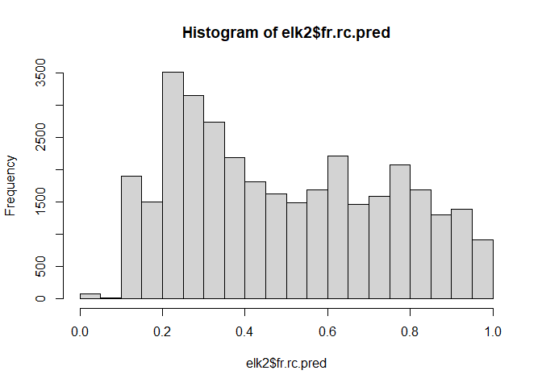<!-- --> Note that
this is the histogram of predictions to both the 0’s and 1’s in the
dataset, not just the 0’s as Avgar et al. (2017) advocate to be able to
intepret the probabiltiy of use, not just seleciton, given the
distribution of available covariates in a study area (see lab
presentaiton, and forthcoming R code example).

Next, we do the basic predictions which are the fixed-effects
unconditional on the random effects (i.e., Naive logit)

``` r
elk2$fr.rc.pred2 <- predict(fr.rc, re.form = NA, type = "response")
summary(elk2$fr.rc.pred2)
```

    ##    Min. 1st Qu.  Median    Mean 3rd Qu.    Max. 
    ##  0.0000  0.3099  0.3763  0.3976  0.5421  0.9994

But note now we can make predictions for JUST individual elk ignoring
the variation between individuals in predation risk responses

``` r
elk2$fr.rc.pred3 <- predict(fr.rc, re.form = ~(1|elkuid) , type = "response")
summary(elk2$fr.rc.pred3)
```

    ##    Min. 1st Qu.  Median    Mean 3rd Qu.    Max. 
    ##  0.0000  0.2259  0.5848  0.5184  0.7853  0.9999

``` r
hist(elk2$fr.rc.pred3)
```

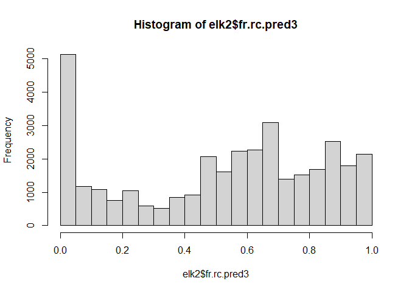<!-- -->

This is the plot of the predictions from the unconditional predictions
(X) versus the fully-specified random effects of risk\|elkid (y). But
this isnt as complicated as it can get, as we saw in LAb 7. I review
these different types of predictions here because we will continue to
explore the complexity in making predictions from mixed-effects models
this week but with the added twist of fitting inhomogenous spatial point
process models.

# Running glmmTMB models

First, we have to think about the concepts of weighting the 0’s
infinitely, or, with a very large variance to approximate the
inhomogenous spatial point process likelihood with a used-available
design. The response variable, the probability of selection, Ynj, in RSF
Used-Available designs are not strictly speaking a proper Bernoulli
random variable. They are from a log-linear Inhomogenous Point Process
model. It turns out that these two likelihoods, for a logistic
regression and IPP model are equivalent when number of available points
are really big, hence, advice from Northrup to go BIG. However, using a
large number of points is computationally inefficient. Fithian and
Hastie (2013) elegantly show same result when infinite weights are
assigned to all available points. i.e., the binomial logistic regression
likelihood converges to the IPP likelihood.

Implications: if we can fit weights to 0’s, we can use logistic
regression AS IS.

Thus, the first thing we need to do is add a column for weights. This is
from Fithian and Hastie (2013), who showed that instead of having to use
a super high ratio of available:used locations, you can just weight the
available points with a really high value because this approximates the
massive integral in the denominator for the weighted distribution
equation. So following Muff et al. (2019), we set `w` for available
locations to 5000 and to 1 for used locations.

``` r
elk2 <-
  elk2 %>% 
  as_tibble() %>% 
  mutate(w=if_else(used==0, 5000,1),
         elkuid = as.factor(elkuid),
         used = as.factor(used),
         log_risk = log(ctotrisk),
         log_risk_sc = as.numeric(scale(log_risk))) %>% 
  rename(totalherb2_sc = for2_sc)
```

Learn about glmmTMB here ?glmmTMB

and here:
<https://cran.r-project.org/web/packages/glmmTMB/vignettes/glmmTMB.pdf>

glmmTMB is an R package for fitting generalized linear mixed models
(GLMMs) and extensions, built on Template Model Builder, which is in
turn built on CppAD and Eigen. It is intended to handle a wide range of
statistical distributions (Gaussian, Poisson, binomial, negative
binomial, Beta …) as well as model extensions such as zero-inflation,
heteroscedasticity, and autocorrelation. Fixed and random effects models
can be specified for the conditional and zero-inflated components of the
model, as well as fixed effects models for the dispersion parameter.

Now here is the actual `glmmTMB` model. This first one is a mixed
effects model with a random intercept only. You’ll notice this is the
same syntax as `lme4::glmer` but it has the `map` and `start` arguments.
The `map` argument just says tells `glmmtmb` to not estimate the
variance for the first random effect (`NA`), which is the random
intercept. If you have random slopes, you add placeholders for the
random slopes immediately after the `NA` value (see below in the random
slopes model). These placeholders let `glmmTMB` know to freely estimate
the variance for the random slopes.

The ‘start’ argument tells glmmTMB to fix the variance of the first
random effect (intercept) at a high value, such as `log(1e3)`; All the
subsequent values (any random slopes) others get a value of 0.

So, if you always specify your random intercept(s) **first**, then it’s
easy to make sure that you don’t accidentally fix the variance of a
random slope. If you do screw it up, you will see it in the summary
output. Always check the summary to make sure the variance of the random
intercept(s) is 1,000,000. This model took \~ 30 seconds to run on my
CPU. `glmmTMB` is fast.

## Random intercept only

``` r
system.time(
  forage_risk_r_int <- glmmTMB(used ~ totalherb_sc + totalherb2_sc + log_risk_sc + 
                               (1|elkuid),
                             weights = w, data=elk2, family=binomial,
                             map=list(theta=factor(NA)),
                             start=list(theta=log(1e3)))
)
```

    ##    user  system elapsed 
    ##    7.16    0.07    7.33

``` r
summary(forage_risk_r_int)
```

    ##  Family: binomial  ( logit )
    ## Formula:          
    ## used ~ totalherb_sc + totalherb2_sc + log_risk_sc + (1 | elkuid)
    ## Data: elk2
    ## Weights: w
    ## 
    ##       AIC       BIC    logLik  deviance  df.resid 
    ##  302250.7  302284.5 -151121.3  302242.7     34386 
    ## 
    ## Random effects:
    ## 
    ## Conditional model:
    ##  Groups Name        Variance Std.Dev.
    ##  elkuid (Intercept) 1e+06    1000    
    ## Number of obs: 34390, groups:  elkuid, 17
    ## 
    ## Conditional model:
    ##                 Estimate Std. Error z value Pr(>|z|)    
    ## (Intercept)   -7.205e-04  2.425e+02    0.00        1    
    ## totalherb_sc   1.758e+00  2.026e-02   86.78   <2e-16 ***
    ## totalherb2_sc -9.554e-01  1.937e-02  -49.32   <2e-16 ***
    ## log_risk_sc   -2.954e-01  1.027e-02  -28.75   <2e-16 ***
    ## ---
    ## Signif. codes:  0 '***' 0.001 '**' 0.01 '*' 0.05 '.' 0.1 ' ' 1

If you’re curious about how different a model is without fixing the
random intercept variance at a high value, you can run that model and
compare the coefficients to the model above.

``` r
system.time(
  forage_risk_r_int_free <- glmmTMB(used ~ totalherb_sc + totalherb2_sc + log_risk_sc + 
                               (1|elkuid),
                             weights = w, data=elk2, family=binomial)
)
```

    ##    user  system elapsed 
    ##   14.42    0.01   14.58

``` r
summary(forage_risk_r_int_free)
```

    ##  Family: binomial  ( logit )
    ## Formula:          
    ## used ~ totalherb_sc + totalherb2_sc + log_risk_sc + (1 | elkuid)
    ## Data: elk2
    ## Weights: w
    ## 
    ##       AIC       BIC    logLik  deviance  df.resid 
    ##  302024.9  302067.1 -151007.5  302014.9     34385 
    ## 
    ## Random effects:
    ## 
    ## Conditional model:
    ##  Groups Name        Variance Std.Dev.
    ##  elkuid (Intercept) 0.5576   0.7467  
    ## Number of obs: 34390, groups:  elkuid, 17
    ## 
    ## Conditional model:
    ##               Estimate Std. Error z value Pr(>|z|)    
    ## (Intercept)   -8.23885    0.18139  -45.42   <2e-16 ***
    ## totalherb_sc   1.75887    0.02026   86.80   <2e-16 ***
    ## totalherb2_sc -0.95584    0.01938  -49.33   <2e-16 ***
    ## log_risk_sc   -0.29604    0.01027  -28.83   <2e-16 ***
    ## ---
    ## Signif. codes:  0 '***' 0.001 '**' 0.01 '*' 0.05 '.' 0.1 ' ' 1

``` r
plot_model(forage_risk_r_int_free, transform=NULL)
```

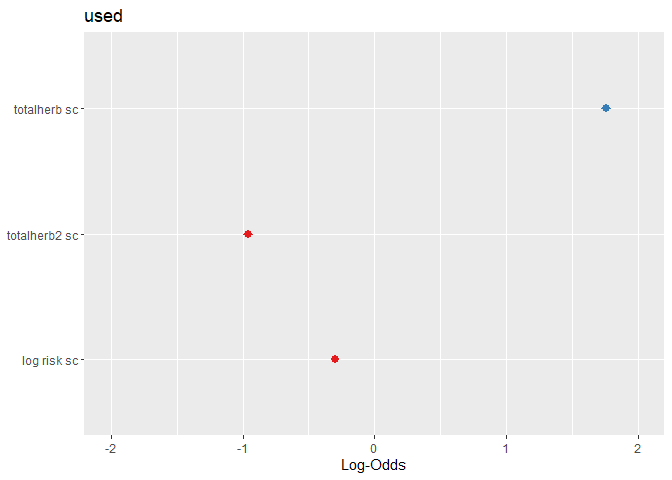<!-- -->

The coefficients didn’t change. *But*, the model with the fixed random
effect variance fit **took less than half** the time to fit (on my
computer), and that makes a big difference when you have huge datasets
and big candidate model sets. According to Muff et al., not fixing the
random intercept variance at a high value **can** lead to unbiased
coefficients.

## Random slope models

This next model has a random intercept and a random slope for
`log_risk_sc` at the individual level. The `(0 +` part of the random
slope syntax tells `glmmTMB` that the random slope is not correlated
with the random intercept. `sjPlot::plot_model` is a quick way to plot
model coefficients.

``` r
system.time(
  forage_risk_slope_risk <- glmmTMB(used ~ totalherb_sc + totalherb2_sc + log_risk_sc + 
                                    (1|elkuid) + (0 + log_risk_sc|elkuid), 
                                  data=elk2, family=binomial, weights = w, 
                                  map=list(theta=factor(c(NA, 1))),
                                  start=list(theta=c(log(1e3), 0)))
)
```

    ##    user  system elapsed 
    ##    9.22    0.11    9.50

``` r
summary(forage_risk_slope_risk)
```

    ##  Family: binomial  ( logit )
    ## Formula:          
    ## used ~ totalherb_sc + totalherb2_sc + log_risk_sc + (1 | elkuid) +  
    ##     (0 + log_risk_sc | elkuid)
    ## Data: elk2
    ## Weights: w
    ## 
    ##       AIC       BIC    logLik  deviance  df.resid 
    ##  298585.8  298628.1 -149287.9  298575.8     34385 
    ## 
    ## Random effects:
    ## 
    ## Conditional model:
    ##  Groups   Name        Variance  Std.Dev. 
    ##  elkuid   (Intercept) 1.000e+06 1000.0000
    ##  elkuid.1 log_risk_sc 7.317e-01    0.8554
    ## Number of obs: 34390, groups:  elkuid, 17
    ## 
    ## Conditional model:
    ##                 Estimate Std. Error z value Pr(>|z|)    
    ## (Intercept)    -0.001101 242.537237    0.00    1.000    
    ## totalherb_sc    1.894081   0.021032   90.06   <2e-16 ***
    ## totalherb2_sc  -1.099100   0.020051  -54.82   <2e-16 ***
    ## log_risk_sc    -0.126249   0.208689   -0.60    0.545    
    ## ---
    ## Signif. codes:  0 '***' 0.001 '**' 0.01 '*' 0.05 '.' 0.1 ' ' 1

``` r
plot_model(forage_risk_slope_risk, transform=NULL)
```

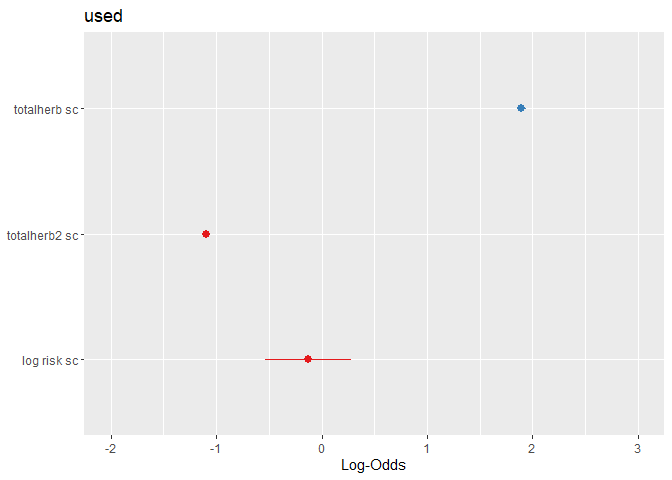<!-- -->

Now `log_risk_sc` is no longer significant because there’s a lot of the
individual heterogeneity in responses to predation risk.

Finally here’s a model where both risk and forage (including a quadratic
term for forage) have random slopes. It took 1.5 minutes to run. You can
see that for both the `map` and `start` arguments, you can just change
the last number (in this case, 3) to the number of random slopes you are
fitting. Note that we could also specify the forage random slopes like
this: `(0 + totalherb_sc + totalherb2_sc | herd)`. The only difference
is that we would be telling the model that the random slopes for those
two terms are correlated with each other. So, you’d add another model
“parameter”, which would be a correlation term between the first-order
and second-order terms. And you’d have to change the 3s to 4s in the
`map` and `start` arguments. I tried specifying the model both ways, and
the results were essentially identical.

``` r
system.time(forage_risk_slopes_both <- glmmTMB(used ~ totalherb_sc + totalherb2_sc + log_risk_sc + 
                                     (1|elkuid) + (0 + totalherb_sc|elkuid) + (0 + totalherb2_sc|elkuid) + 
                                     (0 + log_risk_sc|elkuid), 
                                  data=elk2, family=binomial, weights = w, 
                                  map=list(theta=factor(c(NA, 1:3))),
                                  start=list(theta=c(log(1e3), rep(0,3))))
)
```

    ##    user  system elapsed 
    ##   10.18    0.22   10.63

``` r
summary(forage_risk_slopes_both)
```

    ##  Family: binomial  ( logit )
    ## Formula:          
    ## used ~ totalherb_sc + totalherb2_sc + log_risk_sc + (1 | elkuid) +  
    ##     (0 + totalherb_sc | elkuid) + (0 + totalherb2_sc | elkuid) +  
    ##     (0 + log_risk_sc | elkuid)
    ## Data: elk2
    ## Weights: w
    ## 
    ##       AIC       BIC    logLik  deviance  df.resid 
    ##  290445.9  290505.0 -145215.9  290431.9     34383 
    ## 
    ## Random effects:
    ## 
    ## Conditional model:
    ##  Groups   Name          Variance  Std.Dev.
    ##  elkuid   (Intercept)   1.000e+06 1000.000
    ##  elkuid.1 totalherb_sc  2.324e+00    1.524
    ##  elkuid.2 totalherb2_sc 1.269e+01    3.562
    ##  elkuid.3 log_risk_sc   1.249e+00    1.117
    ## Number of obs: 34390, groups:  elkuid, 17
    ## 
    ## Conditional model:
    ##                 Estimate Std. Error z value Pr(>|z|)    
    ## (Intercept)   -9.723e-04  2.425e+02   0.000 0.999997    
    ## totalherb_sc   2.628e+00  3.737e-01   7.033 2.02e-12 ***
    ## totalherb2_sc -3.221e+00  8.736e-01  -3.687 0.000227 ***
    ## log_risk_sc   -1.804e-01  2.719e-01  -0.663 0.507155    
    ## ---
    ## Signif. codes:  0 '***' 0.001 '**' 0.01 '*' 0.05 '.' 0.1 ' ' 1

``` r
sjPlot::plot_model(forage_risk_slopes_both, transform=NULL)
```

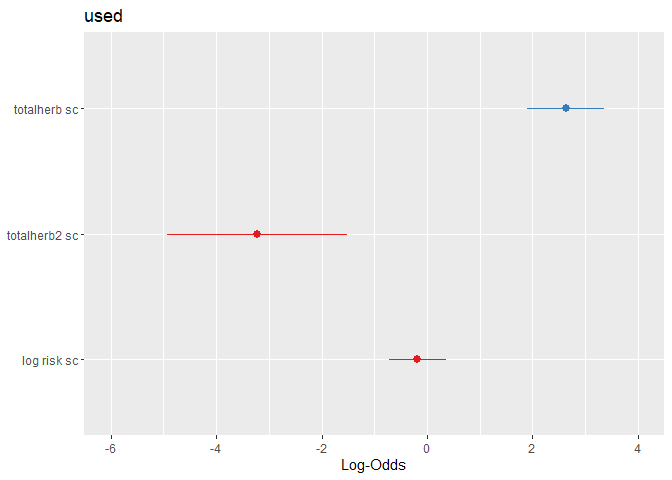<!-- -->

Both forage terms are still highly significant.

Quickly see how much better the model with three random slopes is
compared to just one, or to a model with just a random intercept.

``` r
bbmle::AICtab(forage_risk_r_int, forage_risk_slope_risk, forage_risk_slopes_both)    
```

    ##                         dAIC    df
    ## forage_risk_slopes_both     0.0 7 
    ## forage_risk_slope_risk   8140.0 5 
    ## forage_risk_r_int       11804.8 4

# Extract and plot random coefficients

There are a few ways to get individual-level random coefficients for
each elk. These random coefficients are actually best unbiased linear
predictors (BLUPs), so they’re not technically the same as a random
parameter as in a Bayesian model.
[Here’s](https://bbolker.github.io/mixedmodels-misc/glmmFAQ.html#confidence-intervals-on-conditional-meansblupsrandom-effects)
a helpful rambling on BLUPs from Ben Bolker. The reason this is
important is when you are trying to construct confidence intervals
around the random coefficients. Because the standard deviations of the
fixed and random coefficients are not independent, it’s pretty much
impossible to separate them. You could estimate them in a Bayesian
model, but in a frequentist framework, you really can’t. So if you want
to calculate or plot the standard deviations of the random coefficients,
you might just want to be conservative and add the standard deviations
(std.error) from the `broom.mixed` tidy function to the standard error
of the fixed effts and then construct confidence intervals. They’ll
likely be too wide, but that’s better than the alternative.

To get an idea of the random coefficients, you can use `ranef`, but note
that these are offets from the fixed effects, so they are normally
distributed and centered around zero. To get the actual coefficients,
you’d have to add these to the fixed effects (see below). *Note:* don’t
get thrown off by the random intercepts not being centered around zero,
because we messed with those by fixing the variance super high.

``` r
ranef(forage_risk_slopes_both)
```

    ## $elkuid
    ##     (Intercept) totalherb_sc totalherb2_sc log_risk_sc
    ## 2     -9.901153  -2.84828777     2.5709332  1.45328077
    ## 5    -11.217667   1.36156506    -9.5031003 -0.24627935
    ## 25    -9.826568  -0.01794663    -1.5517964 -0.04233810
    ## 29   -11.607611   2.47251166    -8.1704455 -0.05535730
    ## 42    -8.825121   0.29754944    -0.8660579  0.82652064
    ## 56    -8.817017  -0.16305006     2.2535743 -0.95131862
    ## 59    -8.007300  -0.31919088     2.4050575 -1.49440524
    ## 73    -8.683411   0.63175395     2.0113837 -1.34759768
    ## 74    -8.639141  -0.96199446     2.2973416 -0.19966364
    ## 78    -7.638544   1.59054307    -0.6978838  0.01367943
    ## 90    -7.516343   1.31621912    -0.8679604  0.25906124
    ## 92    -7.334404   0.79756359     0.5581619 -1.17897746
    ## 93    -7.977249  -0.60284829     2.1232919  0.41931492
    ## 94    -9.485401  -0.33956926     2.2609122  0.50076931
    ## 96    -8.784906   0.12580810     1.6566249 -0.75205003
    ## 104   -8.543529   0.46483097     1.2585821 -0.44825830
    ## 196  -13.723220  -3.98401679     2.8204735  3.23754979

If you quickly want to see the coeffients themselves (rather than just
the offsets from the fixed effects), you can use `coef`. As with the
`ranef` function above, if you actually want to manipulate them, you
have to convert the coef output into a data frame or tibble.

``` r
coef(forage_risk_slopes_both)
```

    ## $elkuid
    ##     (Intercept) totalherb_sc totalherb2_sc log_risk_sc
    ## 2     -9.902125   -0.2200008    -0.6497814  1.27291329
    ## 5    -11.218639    3.9898520   -12.7238149 -0.42664683
    ## 25    -9.827540    2.6103404    -4.7725110 -0.22270558
    ## 29   -11.608583    5.1007986   -11.3911601 -0.23572478
    ## 42    -8.826094    2.9258364    -4.0867725  0.64615316
    ## 56    -8.817989    2.4652369    -0.9671403 -1.13168610
    ## 59    -8.008272    2.3090961    -0.8156571 -1.67477271
    ## 73    -8.684383    3.2600409    -1.2093309 -1.52796516
    ## 74    -8.640113    1.6662925    -0.9233730 -0.38003112
    ## 78    -7.639516    4.2188301    -3.9185984 -0.16668805
    ## 90    -7.517315    3.9445061    -4.0886750  0.07869376
    ## 92    -7.335376    3.4258506    -2.6625527 -1.35934494
    ## 93    -7.978221    2.0254387    -1.0974227  0.23894744
    ## 94    -9.486374    2.2887177    -0.9598024  0.32040183
    ## 96    -8.785878    2.7540951    -1.5640897 -0.93241750
    ## 104   -8.544502    3.0931179    -1.9621325 -0.62862578
    ## 196  -13.724192   -1.3557298    -0.4002411  3.05718231

``` r
as_tibble(rownames_to_column(coef(forage_risk_slopes_both)$cond$elkuid, "elkuid")) %>% 
  dplyr::select(-"(Intercept)")
```

    ## # A tibble: 17 × 4
    ##    elkuid totalherb_sc totalherb2_sc log_risk_sc
    ##    <chr>         <dbl>         <dbl>       <dbl>
    ##  1 2            -0.220        -0.650      1.27  
    ##  2 5             3.99        -12.7       -0.427 
    ##  3 25            2.61         -4.77      -0.223 
    ##  4 29            5.10        -11.4       -0.236 
    ##  5 42            2.93         -4.09       0.646 
    ##  6 56            2.47         -0.967     -1.13  
    ##  7 59            2.31         -0.816     -1.67  
    ##  8 73            3.26         -1.21      -1.53  
    ##  9 74            1.67         -0.923     -0.380 
    ## 10 78            4.22         -3.92      -0.167 
    ## 11 90            3.94         -4.09       0.0787
    ## 12 92            3.43         -2.66      -1.36  
    ## 13 93            2.03         -1.10       0.239 
    ## 14 94            2.29         -0.960      0.320 
    ## 15 96            2.75         -1.56      -0.932 
    ## 16 104           3.09         -1.96      -0.629 
    ## 17 196          -1.36         -0.400      3.06

If we plot these, we’ll notice that the coefficients for the first-order
term of forage, `totalherb_sc`, are normally-ish distributed and
centered around the fixed effect, which is about 2.6. Obviously, you
need both the first- and second-order (squared term) coefficients for
forage to understand the response, but for simplicity in this example,
I’ll just use the first-order term.

``` r
as_tibble(rownames_to_column(coef(forage_risk_slopes_both)$cond$elkuid, "elkuid")) %>% 
  dplyr::select(totalherb_sc) %>% 
  ggplot(., aes(x=totalherb_sc)) +
  geom_histogram() +
  geom_vline(xintercept = fixef(forage_risk_slopes_both)$cond["totalherb_sc"], 
             color = "orange", linetype="dashed", size = 1) +
  theme_classic()
```

    ## Warning: Using `size` aesthetic for lines was deprecated in ggplot2 3.4.0.
    ## ℹ Please use `linewidth` instead.

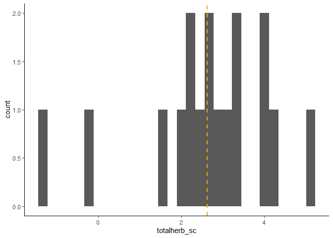<!-- -->

If you want to get the the conditional standard deviations (std.error)
for the random coefficients to construct confidence intervals, use
`broom.mixed::tidy`. Again, these are not technically the same as
conditional standard errors you get in a Bayesian Model. The `ran_vals`
argument also just gives you offsets from the fixed effects, so you have
to add them to the fixed effect to get the individual-level coefficient.

``` r
broom.mixed::tidy(forage_risk_slopes_both, effects = "ran_vals")
```

    ## # A tibble: 68 × 7
    ##    effect   component group  level term        estimate std.error
    ##    <chr>    <chr>     <chr>  <chr> <chr>          <dbl>     <dbl>
    ##  1 ran_vals cond      elkuid 2     (Intercept)    -9.90      243.
    ##  2 ran_vals cond      elkuid 5     (Intercept)   -11.2       243.
    ##  3 ran_vals cond      elkuid 25    (Intercept)    -9.83      243.
    ##  4 ran_vals cond      elkuid 29    (Intercept)   -11.6       243.
    ##  5 ran_vals cond      elkuid 42    (Intercept)    -8.83      243.
    ##  6 ran_vals cond      elkuid 56    (Intercept)    -8.82      243.
    ##  7 ran_vals cond      elkuid 59    (Intercept)    -8.01      243.
    ##  8 ran_vals cond      elkuid 73    (Intercept)    -8.68      243.
    ##  9 ran_vals cond      elkuid 74    (Intercept)    -8.64      243.
    ## 10 ran_vals cond      elkuid 78    (Intercept)    -7.64      243.
    ## # … with 58 more rows

Below I create a data frame with the random coefficient values and
confidence intervals for the first-order term of forage, `totalherb_sc`
that incorporate standard errors based on only random coefficients.
Again, these don’t incorporate the uncertainty around the fixed effect
estimate for `totalherb_sc`, so they are likely too narrow.

``` r
forage_ran_coefs <- broom.mixed::tidy(forage_risk_slopes_both, effects = "ran_vals") %>%
  filter(term=="totalherb_sc") %>% 
  dplyr::select(elkuid=level, estimate, std.error) %>% 
  mutate(forage_coef = estimate + fixef(forage_risk_slopes_both)$cond["totalherb_sc"],
         conf_low = forage_coef - std.error*1.96,
         conf_high = forage_coef + std.error*1.96) 

forage_ran_coefs
```

    ## # A tibble: 17 × 6
    ##    elkuid estimate std.error forage_coef conf_low conf_high
    ##    <chr>     <dbl>     <dbl>       <dbl>    <dbl>     <dbl>
    ##  1 2       -2.85       0.389      -0.220   -0.983     0.543
    ##  2 5        1.36       0.504       3.99     3.00      4.98 
    ##  3 25      -0.0179     0.412       2.61     1.80      3.42 
    ##  4 29       2.47       0.442       5.10     4.23      5.97 
    ##  5 42       0.298      0.398       2.93     2.15      3.71 
    ##  6 56      -0.163      0.391       2.47     1.70      3.23 
    ##  7 59      -0.319      0.385       2.31     1.55      3.06 
    ##  8 73       0.632      0.387       3.26     2.50      4.02 
    ##  9 74      -0.962      0.381       1.67     0.919     2.41 
    ## 10 78       1.59       0.405       4.22     3.43      5.01 
    ## 11 90       1.32       0.649       3.94     2.67      5.22 
    ## 12 92       0.798      0.386       3.43     2.67      4.18 
    ## 13 93      -0.603      0.378       2.03     1.28      2.77 
    ## 14 94      -0.340      0.379       2.29     1.54      3.03 
    ## 15 96       0.126      0.381       2.75     2.01      3.50 
    ## 16 104      0.465      0.383       3.09     2.34      3.84 
    ## 17 196     -3.98       0.531      -1.36    -2.40     -0.315

And a plot:

``` r
ggplot(forage_ran_coefs, aes(x=elkuid, y=forage_coef)) +
    coord_flip() +
    geom_hline(yintercept = 0, linetype="dashed") +
    geom_pointrange(aes(ymin = conf_low,
                        ymax = conf_high),
                    size=1) +
    xlab("Elk ID") +
    theme_bw(base_size = 15)
```

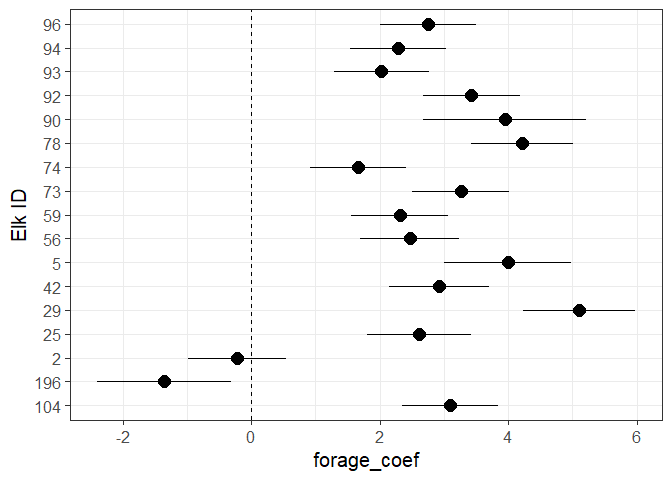<!-- -->

Elk 2 and 196 are a bit gnarly. What’d be nice to see some confirmation
that our random coefficients align with the fixed-effects coefficient
for forage. Below we can see how our fixed effects confidence intervals
on their own, even in a random slopes model where they are much wider
than in a model without random slopes, don’t do a great job of showing
the full spread of the responses.

``` r
fixed_coef <-
  broom.mixed::tidy(forage_risk_slopes_both, effects="fixed", conf.int = T) %>% 
  filter(term == "totalherb_sc")

ggplot(
  forage_ran_coefs, aes(x=elkuid, y=forage_coef)) +
  coord_flip() +
  geom_rect(ymin=fixed_coef$conf.low, ymax=fixed_coef$conf.high,
            xmin=-Inf,xmax=Inf, fill="red", alpha=0.01) +
  geom_hline(yintercept = 0, linetype="dashed") +
  geom_hline(yintercept = fixef(forage_risk_slopes_both)$cond["totalherb_sc"],
             linetype="dashed", color="red", size=1) +
  geom_pointrange(aes(ymin = conf_low,
                      ymax = conf_high),
                  size=1) +
  xlab("Elk ID") +
  theme_bw(base_size = 15)
```

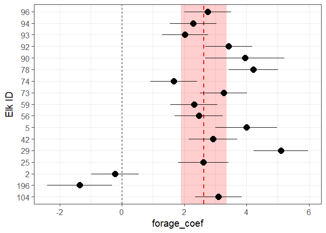<!-- -->

# Fixed-effects predictions

Predicting from a GLMM model in R is fairly straightforward using the
`predict` function in R. Unfortunately, this function doesn’t quite give
the same results as a manual prediction from model coefficients if your
model fixes the random intercept variance at a high value (as Muff et
al. suggest). The `predict` function is somehow taking the random
intercept variance into account in its predictions, so even if we
subtract the intercept itself, the predictions are a little off.

So for this example, we will fit our top model **without** fixing the
random intercept variance, so you can see how to get the exact same
predictions using both the `predict` function and making predictions
manually. But for your own research, it’s probably best to fit the
models as Muff et al. suggest (i.e., fixing the random intercept
variance), and making predictions manually.

``` r
system.time(forage_risk_slopes_both_UNFIXED <- glmmTMB(used ~ totalherb_sc + totalherb2_sc + log_risk_sc + 
                                     (1|elkuid) + (0 + totalherb_sc|elkuid) + (0 + totalherb2_sc|elkuid) + 
                                     (0 + log_risk_sc|elkuid), 
                                  data=elk2, family=binomial, weights = w)
)
```

    ##    user  system elapsed 
    ##   15.53    0.18   15.89

Let’s say you want to predict the relative probability of selection
across the entire range of forage biomass values that elk enounter. To
get fixed effects (population-level) predictions, just create a new data
frame from which to predict, but fill all your grouping variables (in
our case, `elkuid`) with `NA`. Create a sequence of unscaled forage
biomass values from the minimum to maximum values (pooled across all
animals), then scale those values. Since you are trying to isolate the
effect of forage biomass on selection, set scaled prediction risk to 0,
and provide any value (including NA) for `w`. Note that you do *not*
need to go back and fit a separate model with unscaled covariates.
You’ve include both scaled and unscaled versions of forage values in the
new data. We’ll use the scaled values for the predictions and the
unscaled values for plotting the response.

``` r
forage_for_predict_population <-
  tibble(elkuid = NA,
         totalherb = seq(min(elk2$totalherb), max(elk2$totalherb), len=100),
         totalherb2 = totalherb^2,
         totalherb_sc = as.numeric(scale(totalherb)),
         totalherb2_sc = as.numeric(scale(totalherb2)),
         log_risk_sc = 0,
         w = NA) 

forage_for_predict_population
```

    ## # A tibble: 100 × 7
    ##    elkuid totalherb totalherb2 totalherb_sc totalherb2_sc log_risk_sc w    
    ##    <lgl>      <dbl>      <dbl>        <dbl>         <dbl>       <dbl> <lgl>
    ##  1 NA          0          0           -1.71         -1.11           0 NA   
    ##  2 NA          2.26       5.12        -1.67         -1.11           0 NA   
    ##  3 NA          4.53      20.5         -1.64         -1.10           0 NA   
    ##  4 NA          6.79      46.1         -1.60         -1.10           0 NA   
    ##  5 NA          9.05      81.9         -1.57         -1.10           0 NA   
    ##  6 NA         11.3      128.          -1.53         -1.10           0 NA   
    ##  7 NA         13.6      184.          -1.50         -1.09           0 NA   
    ##  8 NA         15.8      251.          -1.46         -1.09           0 NA   
    ##  9 NA         18.1      328.          -1.43         -1.08           0 NA   
    ## 10 NA         20.4      415.          -1.40         -1.08           0 NA   
    ## # … with 90 more rows

Then in the `predict` call, just specifiy `re.form=NA`, which means
ignore all random effects. By default, this `predict` produces
predictions on the scale of the linear predictor. The reason we do this,
and not immediately go back to the real scale, is that we want to
subtract the intercept (which is on the linear predictor scale), so it’s
not included in the predictions. After we’ve subtracted the intercept,
we can exponentiate to get back to the real scale.

``` r
pop_pred_unfixed <-
  forage_for_predict_population %>% 
  mutate(pred_LP = predict(forage_risk_slopes_both_UNFIXED, ., re.form=NA),
         pred_real = exp(pred_LP - fixef(forage_risk_slopes_both_UNFIXED)$cond["(Intercept)"]))
```

Now you can plot the predictions, and find the total biomass value where
relative selection is highest.

``` r
pop_pred_unfixed %>% 
  ggplot(., aes(x=totalherb, y=pred_real)) +
  geom_line(size=1) +
  theme_classic(base_size=15)
```

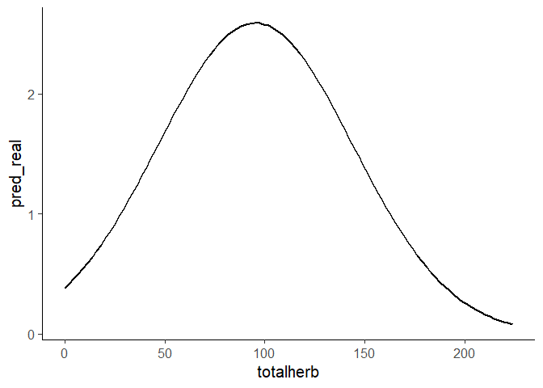<!-- -->

``` r
pop_pred_unfixed %>% 
  filter(pred_real == max(pred_real)) %>% 
  select(totalherb)
```

    ## # A tibble: 1 × 1
    ##   totalherb
    ##       <dbl>
    ## 1      95.0

Selection is highest at a biomass of 95.0. Notice that the y-axis values
don’t look like probabilities, because they aren’t. Because we’re using
an exponential model, these are “relative” probabilities, and the
magnitudes are essentially meaningless.

**NOTE** I did *NOT* use `plogis` (inverse logit) when tranforming
predictions back to the real scale. We are only using logistic
regression to estimate coefficients. But the actual used/available RSF
is an exponential model with no denominator. Even though some folks
might think `plogis` merely bounds the predictions between 0 and 1, it
changes the shape of the response curves (sometimes a lot), and possibly
your inference. It is not technically correct for a used-available RSF!

The problem is that using an inverse logit assumes you are estimating
true probabilities when in an RSF we are only estimating relative
probabilities because we don’t know what is actually “unused” and the
intercept only reflects the ratio of used:available locations. Lots of
papers talk about the difference between RSPFs and RSFs, but Avgar’s
[paper](https://doi.org/10.1002/ece3.3122) has a great explanation with
figures. See Figure 4 for the different predictions between a logistic
(RSPF) and an exponential (RSF) model fit with the same data.

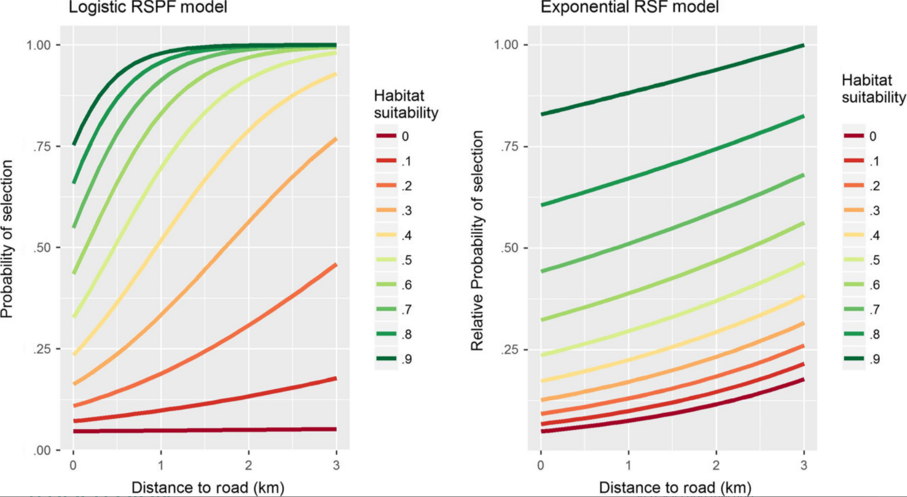

Check out the difference with using `plogis` versus `exp`:

``` r
  forage_for_predict_population %>% 
  mutate(pred_LP = predict(forage_risk_slopes_both_UNFIXED, ., re.form=NA),
         pred_real = plogis(pred_LP - fixef(forage_risk_slopes_both_UNFIXED)$cond["(Intercept)"])) %>% 
  ggplot(., aes(x=totalherb, y=pred_real)) +
  geom_line(size=1) +
  theme_classic(base_size=15)
```

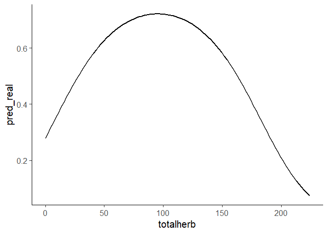<!-- -->

In this case, the difference in shape for the response curve isn’t that
big, but in some models, it’s far more noticeable.

If you (or your manager collaborators) want your predicted values to
*resemble* probabilities, you can just rescale the relative
probabilities to be between 0 and 1, and hopefully that makes folks
happier. To do this, you can use this simple formula: (y - min(y)) /
(max(y) - min(y)). Or you could just divide by the max.

``` r
pop_pred_unfixed %>% 
  mutate(pred_01 = (pred_real - min(pred_real))/diff(range(pred_real))) %>% 
  ggplot(., aes(x=totalherb, y=pred_01)) +
  geom_line(size=1) +
  theme_classic(base_size=15)
```

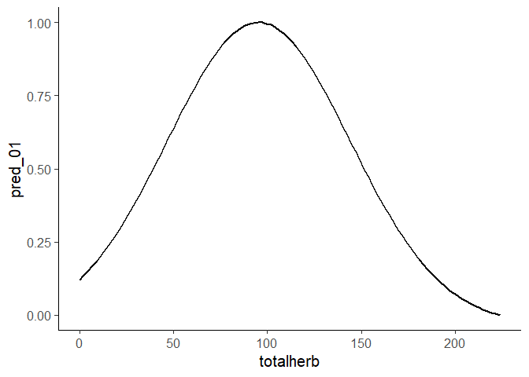<!-- -->

## Manual fixed-effects predictions

We can now do the same prediction manually. First, we can pull the fixed
effects coefficients. Then multiply those by the associated
`totalherb_sc` and `totalherb2_sc` values from our prediction data frame
and exponentiate the results. Note that we don’t need the `log_risk_sc`
coefficient because we set those values to 0, so they cancel out. And we
just omit the intercept.

``` r
coefs_fixed <-
  fixef(forage_risk_slopes_both_UNFIXED)$cond

pop_pred_unfixed_manual <- 
  forage_for_predict_population %>% 
  mutate(pred_real = exp(totalherb_sc*coefs_fixed["totalherb_sc"] +
                           totalherb2_sc*coefs_fixed["totalherb2_sc"]))

ggplot(pop_pred_unfixed_manual, aes(x=totalherb, y=pred_real)) +
  geom_line(size=1) + 
  theme_classic(base_size=15)
```

<!-- -->

``` r
pop_pred_unfixed_manual %>% 
  filter(pred_real == max(pred_real)) %>% 
  select(totalherb)
```

    ## # A tibble: 1 × 1
    ##   totalherb
    ##       <dbl>
    ## 1      95.0

Again, selection is highest at 95.0!

## Confidence intervals around predictions

There is an option to add standard errors in the `predict` function, but
I couldn’t figure out how to get it to ignore the random intercept when
calculating these standard errors, which we use to create confidence
intervals. So, I modified a function that I found on Ben Bolker’s
[blog](https://bbolker.github.io/mixedmodels-misc/glmmFAQ.html#glmmtmb)
so that it calculates standard errors and 95% confidence intervals but
ignores the fixed and random intercepts. The function adds columns for
the prediction and confidence intervals straight to the input data
frame.

``` r
pred_CI <- function(model, newdata=NULL, alpha=0.05) {
  pred0 <- predict(model, re.form=NA, newdata=newdata) - fixef(model)$cond["(Intercept)"]
  X <- model.matrix(formula(model, fixed.only=TRUE)[-2], newdata)[,-1]
  V <- vcov(model)$cond[-1,-1]     
  pred_se <- sqrt(diag(X %*% V %*% t(X))) 
  crit <- -qnorm(alpha/2)
  pred_df <- as_tibble(exp(cbind(pred=pred0, conf.low=pred0-crit*pred_se,
                      conf.high=pred0+crit*pred_se)))
  bind_cols(newdata, pred_df)
}

pred_CI(forage_risk_slopes_both_UNFIXED, forage_for_predict_population)
```

    ## # A tibble: 100 × 10
    ##    elkuid totalherb totalh…¹ total…² total…³ log_r…⁴ w      pred conf.…⁵ conf.…⁶
    ##    <lgl>      <dbl>    <dbl>   <dbl>   <dbl>   <dbl> <lgl> <dbl>   <dbl>   <dbl>
    ##  1 NA          0        0      -1.71   -1.11       0 NA    0.386  0.0419    3.56
    ##  2 NA          2.26     5.12   -1.67   -1.11       0 NA    0.423  0.0465    3.84
    ##  3 NA          4.53    20.5    -1.64   -1.10       0 NA    0.461  0.0515    4.13
    ##  4 NA          6.79    46.1    -1.60   -1.10       0 NA    0.502  0.0570    4.42
    ##  5 NA          9.05    81.9    -1.57   -1.10       0 NA    0.545  0.0629    4.72
    ##  6 NA         11.3    128.     -1.53   -1.10       0 NA    0.591  0.0694    5.03
    ##  7 NA         13.6    184.     -1.50   -1.09       0 NA    0.639  0.0764    5.35
    ##  8 NA         15.8    251.     -1.46   -1.09       0 NA    0.690  0.0841    5.66
    ##  9 NA         18.1    328.     -1.43   -1.08       0 NA    0.743  0.0924    5.98
    ## 10 NA         20.4    415.     -1.40   -1.08       0 NA    0.799  0.101     6.30
    ## # … with 90 more rows, and abbreviated variable names ¹​totalherb2,
    ## #   ²​totalherb_sc, ³​totalherb2_sc, ⁴​log_risk_sc, ⁵​conf.low, ⁶​conf.high

``` r
pred_CI(forage_risk_slopes_both_UNFIXED, forage_for_predict_population) %>% 
  ggplot(., aes(x=totalherb, y=pred)) +
  geom_ribbon(aes(ymin=conf.low, ymax=conf.high), fill="lightgray") +
  geom_line(size=1) + 
  theme_classic(base_size=15) 
```

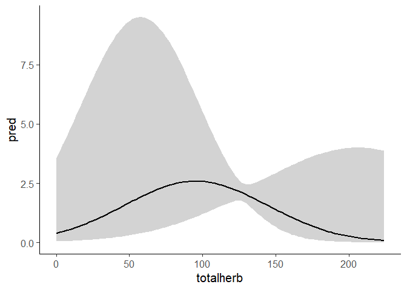<!-- -->

VERY wide confidence intervals here, which is sometimes the case for
mixed-effects models that properly account for individual variation in
responses. This is largely driven by four individuals. Two with very low
random coefficients for forage, and two with very low coefficients for
forage<sup>2</sup>.

# Individual-level predictions

Just as with the fixed effects predictions, you need all the same
columns that are in the model formula, including the `w` column. To do
this, find the min and max of available `totalherb` values that each elk
encounters. Here we take the `elkuid` and `totalherb` columns from the
`elk2` data frame, then nest by `totalherb`. This creates a list-column
where the forage values for each elk are in their own separate tibble.
We then map a function that for each elk, calculates a sequence of 100
values between the min and max of `totalherb` Then unnest the data and
add in the remaining columns that we used in the model.

``` r
for_predict_ind <-
  elk2 %>% 
  select(elkuid, totalherb) %>%
  nest(data = c(totalherb)) %>%
  mutate(totalherb = map(data, ~seq(min(.), max(.), len=100))) %>%
  unnest(totalherb) %>% 
  mutate(totalherb2 = totalherb^2,
         totalherb_sc = as.numeric(scale(totalherb)),
         totalherb2_sc = as.numeric(scale(totalherb2)),
         log_risk = 0,
         w=NA) %>% 
  select(-data) 

for_predict_ind
```

    ## # A tibble: 1,700 × 7
    ##    elkuid totalherb totalherb2 totalherb_sc totalherb2_sc log_risk w    
    ##    <fct>      <dbl>      <dbl>        <dbl>         <dbl>    <dbl> <lgl>
    ##  1 73          0          0           -1.55        -0.937        0 NA   
    ##  2 73          1.34       1.80        -1.53        -0.937        0 NA   
    ##  3 73          2.69       7.22        -1.50        -0.936        0 NA   
    ##  4 73          4.03      16.2         -1.47        -0.935        0 NA   
    ##  5 73          5.37      28.9         -1.45        -0.934        0 NA   
    ##  6 73          6.72      45.1         -1.42        -0.932        0 NA   
    ##  7 73          8.06      65.0         -1.39        -0.930        0 NA   
    ##  8 73          9.40      88.4         -1.37        -0.927        0 NA   
    ##  9 73         10.7      116.          -1.34        -0.924        0 NA   
    ## 10 73         12.1      146.          -1.32        -0.921        0 NA   
    ## # … with 1,690 more rows

We’ll make predictions manually first. But this time, we’ll do it from
the original model where we fixed the variance of the random intercept.
Then, we’ll use the `predict` function, and you can see how the
predictions vary between the two methods, because I can’t find a way to
get `predict` to ignore the random intercept variance.

First, let’s just check out the random coefficients (not just offsets
from the fixed effects) for each elk, including the elk-specific
intercepts, because we’ll use them to predict. Using the `coef` function
here is fast because the data are already in wide format with separate
columns for each covariate. We can rename the column names so it’s clear
they are the coefficients, before we join them to our prediction data
frame that we just created.

``` r
coefs_ind <-   
  rownames_to_column(coef(forage_risk_slopes_both)$cond$elkuid, "elkuid") %>% 
  rename(ran_int = `(Intercept)`,
         forage_coef = totalherb_sc,
         forage2_coef = totalherb2_sc) 

for_predict_ind <-
  for_predict_ind %>% 
  inner_join(coefs_ind)
```

Now the math is pretty simple, and everything we need is in one
dataframe. Remember, we need to subtract the random intercept.

``` r
for_predict_ind %>%
  mutate(pred = exp(totalherb_sc*forage_coef + totalherb2_sc*forage2_coef)) %>% 
  ggplot(., aes(x=totalherb, y=pred, color=elkuid)) +
  geom_line(size=1) +
  theme_classic(base_size=15)
```

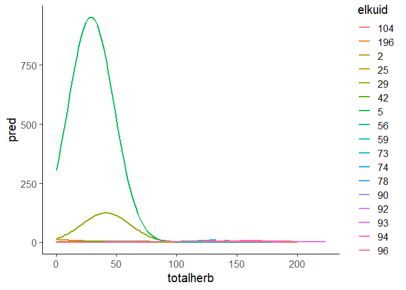<!-- -->

Okay, that looks messy, but it underscores how the magnitudes of the
predictions mean nothing. All we care about is the shapes of the
response curves, and where on the x-axis the peak response occurs.

Let’s zoom in so we can actually see more of the responses.

``` r
for_predict_ind %>%
  mutate(pred = exp(totalherb_sc*forage_coef + totalherb2_sc*forage2_coef)) %>% 
  ggplot(., aes(x=totalherb, y=pred, color=elkuid)) +
  geom_line(size=1) +
  theme_classic(base_size=15) +
  coord_cartesian(xlim= c(0,200), ylim=c(0,10))
```

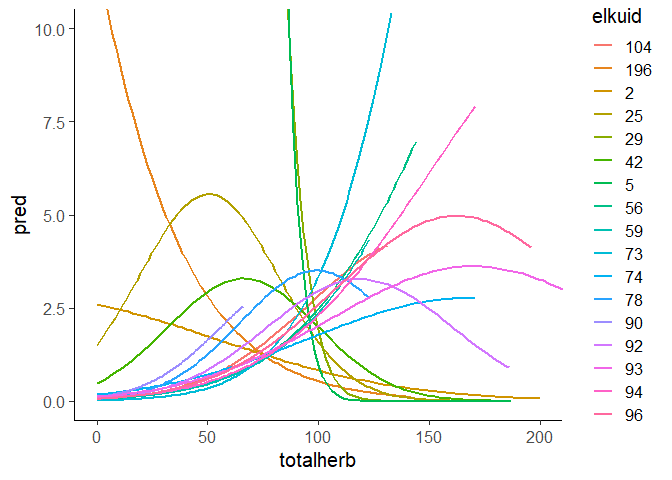<!-- -->

Wow! Again we are struck by the magnitude of the variation. What a
cluster. To see if this makes sense, we can quickly use our `pred_CI`
function to predict fixed effects response and then plop it on top of
this.

``` r
fixed_response <- pred_CI(forage_risk_slopes_both, forage_for_predict_population)

for_predict_ind %>%
  mutate(pred = exp(totalherb_sc*forage_coef + totalherb2_sc*forage2_coef)) %>% 
  ggplot(., aes(x=totalherb, y=pred, color=elkuid)) +
    geom_ribbon(data=fixed_response, aes(ymin = conf.low, ymax = conf.high), fill="lightgray", alpha = .4, color=NA) +
    geom_line(size=1) +
    geom_line(data = fixed_response, size = 2, color="black") + 
    theme_classic(base_size=15) +
    coord_cartesian(xlim= c(0,200), ylim=c(0,10))
```

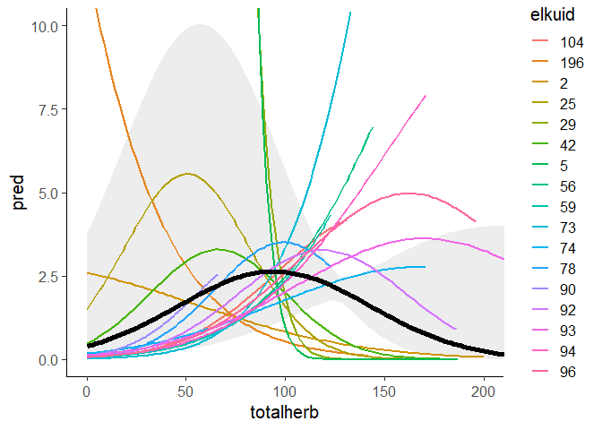<!-- -->

Okay, it does seem to make sense. Not the best example, but it does show
a LOT of individual variation!

Here’s the same plot of the predictions using the `predict` function.
Notice that we have to subtract the random intercepts after we predict
on the linear predictor scale, but before we transform to the real
scale.

``` r
for_predict_ind %>%
  mutate(pred = exp(predict(forage_risk_slopes_both, .) - ran_int)) %>% 
  ggplot(., aes(x=totalherb, y=pred, color=elkuid)) +
    geom_ribbon(data=fixed_response, aes(ymin = conf.low, ymax = conf.high), fill="lightgray", alpha = .4, color=NA) +
    geom_line(size=1) +
    geom_line(data = fixed_response, size = 2, color="black") + 
    theme_classic(base_size=15) +
    coord_cartesian(xlim= c(0,200), ylim=c(0,10))
```

<!-- -->

It’s hard to see which is correct here, but basically, because the
`predict` function still (somehow) accounts for the random intercept
variance, we should steer clear of using it when we screw with the
random intercept variance.

Overall, it’s probably best to do the predictions manually, because you
can control what’s going on, and you can fix the random intercept
variance, which makes your models converge faster and might help prevent
biased coefficients. And, it’s a good idea to plot the predicted fixed
effects response over the top of the individual-level responses, because
in most cases (maybe not here), it can tell you if something is off.

In this model, some of the random coefficients for forage are a bit
wild, which could possibly be helped by log-transforming forage (it is
heavily right-skewed, just like predation risk) or maybe increasing the
availability sample for some individuals. Or, maybe there are other
covariates that aren’t included in the model that might help explain
more of the variation. Only Mark knows the truth.

# Plotting Predicted Probability of USE

Following Avgar et al. 2017, we will now calculate the probability of
use for just the available study area samples, which takes the
probabilities of selection, but just for the availability distribution,
which ends up equalling the probability of use. Read:

Avgar, T., S. R. Lele, J. L. Keim, and M. S. Boyce. 2017. Relative
Selection Strength: Quantifying effect size in habitat- and
step-selection inference. Ecol Evol 7:5322-5330.10.1002/ece3.3122

To visualize the average effect of distance to road on the probability
of space use by elk, we conducted the following analysis.

1.  Fit the exponential RSF (or, logistic RSPF) model using two
    covariates; habitat suitability index and distance to road.

2.  Compute the fitted exponential RSF (or, logistic RSPF) values *at
    the available locations*, namely {w(x1), w(x2), …, w(xN)}.

3.  Plot the points {h1(xi), w(xi); i = 1, 2, …, N} where h1(x) is the
    distance to road for location x.

4.  Use the function ksmooth in R to fit a smooth nonparametric
    regression function through these points.

``` r
elk2 %>%
  filter(used==0) %>%
  mutate(elkuid=NA,
         predict = exp(predict(forage_risk_slopes_both, ., re.form = NA) - fixef(forage_risk_slopes_both)$cond["(Intercept)"])) %>%
  ggplot(., aes(x = totalherb, y = predict)) +
  geom_smooth(alpha=0.2, size=1.6) +
  theme_classic(base_size=20)
```

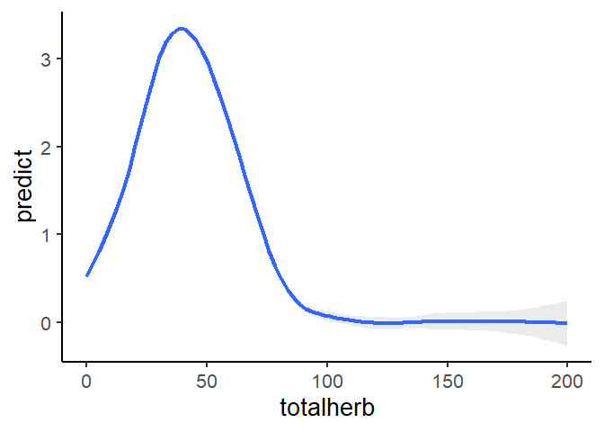<!-- -->

First, note that the 95% CI’s are too narrow, because we are ignoring
the conditional variances again. Also, note how these are quite
different from the average theoretical predicted peak probability of
selection at 95grams. This is because this approach accounts for
prediction to just the 0’s, i.e, your study area encounter/availability
domain, and, the resultant correlations between your covariates, their
distributions, and juxtapositions in your real landscape.

# Generalized functional response (GFR)

A shortcut way to get an individual-level average availability for a
covariate (without averaging across all raster pixel values for that
covariate within a home range – doable, but more time consuming) is to
just summarize availability within the RSF data frame.

``` r
elk2 <-  
  elk2 %>% 
    group_by(elkuid) %>% 
    mutate(mean_risk = mean(log_risk[used==0]),
           mean_herb = mean(totalherb[used==0]),
           mean_herb2 = mean(for2[used==0])) %>% 
    ungroup() %>% 
    mutate(mean_risk_sc = as.numeric(scale(mean_risk)),
           mean_herb_sc = as.numeric(scale(mean_herb)),
           mean_herb2_sc = as.numeric(scale(mean_herb2)))
```

Lets visualize the mean availabilities of predation risk and herbaceous
forage biomass across individual elk.

``` r
hist(elk2$mean_risk_sc)
```

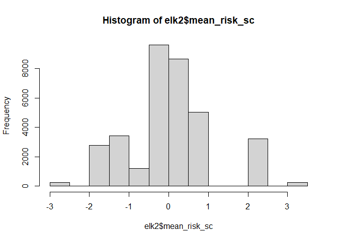<!-- -->

``` r
hist(elk2$mean_herb2)
```

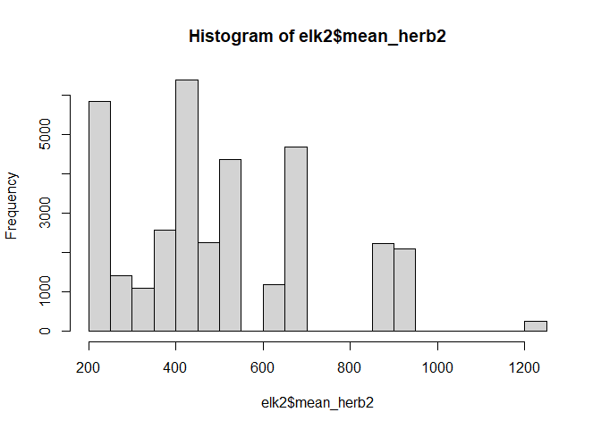<!-- -->

Now interact the covariates with their respective average availabilities
(“expectations” per [Matthiopoulos et
al. 2011](https://doi.org/10.1890/10-0751.1)). Matthiopoulos would also
suggest including ALL combinations of covariates and expectations. This
is probably good if your end goal is to create a predictive map and make
sure your model is transferable, meaning the model can predict use
*outside* of your study area. For this simple example, we’ll just
interact the coefficients with their own expectatations.

``` r
forage_risk_slopes_both_FR <- glmmTMB(used ~ totalherb_sc + totalherb2_sc + log_risk_sc + 
                                        log_risk_sc:mean_risk_sc + totalherb_sc:mean_herb_sc + 
                                        totalherb2_sc:mean_herb2_sc + 
                                        (1|elkuid) + (0 + totalherb_sc|elkuid) + (0 + totalherb2_sc|elkuid) +
                                        (0 + log_risk_sc|elkuid), 
                                   data=elk2, family=binomial, weights = w, 
                                   map=list(theta=factor(c(NA, 1:3))),
                                   start=list(theta=c(log(1e3), rep(0,3))))

plot_model(forage_risk_slopes_both_FR, transform = NULL)
```

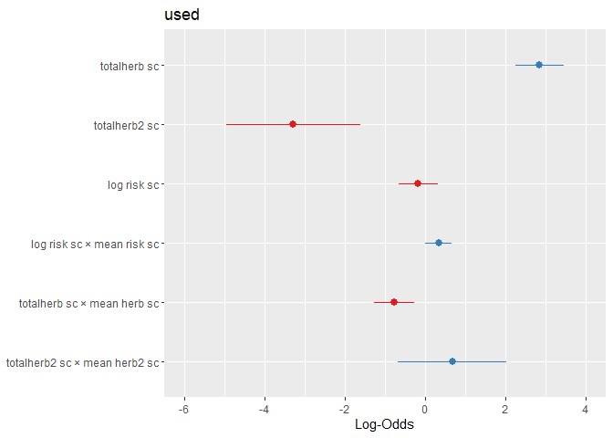<!-- -->

Looks like as the average forage availability improves, relative
selection for high forage might decline.

Including the functional responses doesn’t really improve the AIC score
much. But again, it might improve predictions if you tried to use your
model to predict outside of the study area.

``` r
bbmle::AICtab(forage_risk_slopes_both, forage_risk_slopes_both_FR)
```

    ##                            dAIC df
    ## forage_risk_slopes_both_FR  0.0 10
    ## forage_risk_slopes_both     5.9 7
